## Final_PJT - Movie

### Brief information

* 시행 날짜 : 2022.05.19(목) ~ 2022.05.26(목)
* 개발도구 및 라이브러리 : VSCode, Django 3.2+, Bootstrap v5, Chrome Browser
* 목표
  * 영화 데이터 기반 추천 서비스 구성
  * 영화 추천 알고리즘 구성
  * 커뮤니티 서비스 구성
  * HTML, CSS, JavaScript, Vue.js, Django, REST API, Database 등을 활용한 실제 서비스 설계
  * 서비스 관리 및 유지보수


---

### 1. 팀원 정보 및 업무 분담 내역

- 팀장 : 오광휘
- 팀원 : 금동운

|      |           오광휘           |           금동운            |              공통               |
| :--: | :------------------------: | :-------------------------: | :-----------------------------: |
| 5/19 |         ERD 만들기         |         README 시작         |  기획 및 Django 기본세팅 완료   |
| 5/20 |        base, movie         |     accounts, community     |   디자인 기획 및 오류 디버깅    |
| 5/23 |       TMDB api 파싱        | profile 좋아요, 팔로우 구현 |       영화 추천 기능 구현       |
| 5/24 | Templates 및 Button 디자인 |  community 댓글 및 디자인   | 오류 디버깅 및 전체 디자인 확정 |
| 5/25 |   mainpage, navbar 수정    |  card, 표현 세부사항 수정   | navbar 및 card 세부 디자인 수정 |
| 5/26 |   전체 및 세부 CSS 적용    |   movie 평점 및 댓글 구현   |      오류 디버깅 및 마무리      |
| 5/27 |          PPT 제작          |        README 마무리        |    전체 마무리 및 발표 준비     |


### 2. 목표 서비스 구현 및 실제 구현 정도

##### A. Account _ Sign up & Log in & Profile

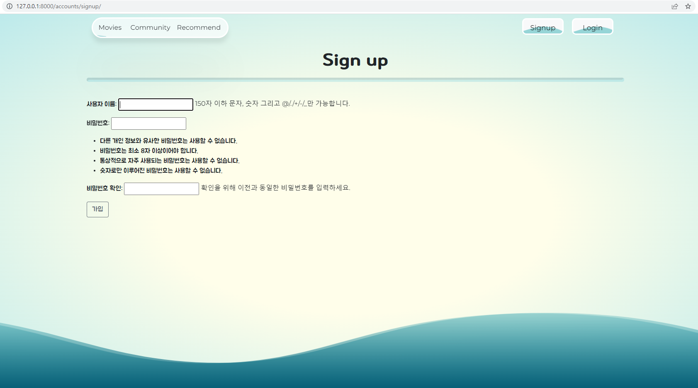

- 내장된 Form을 사용하여 Signup 기능을 구현


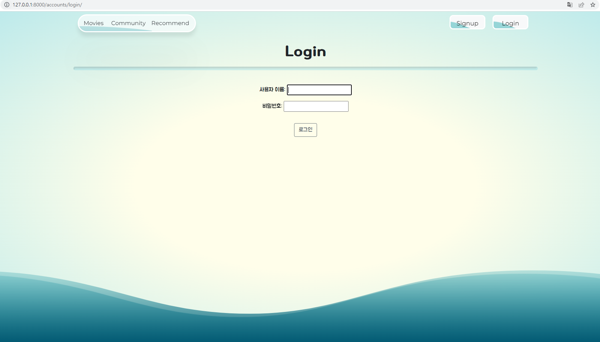

- 내장된 Form을 사용하여 login 기능을 구현


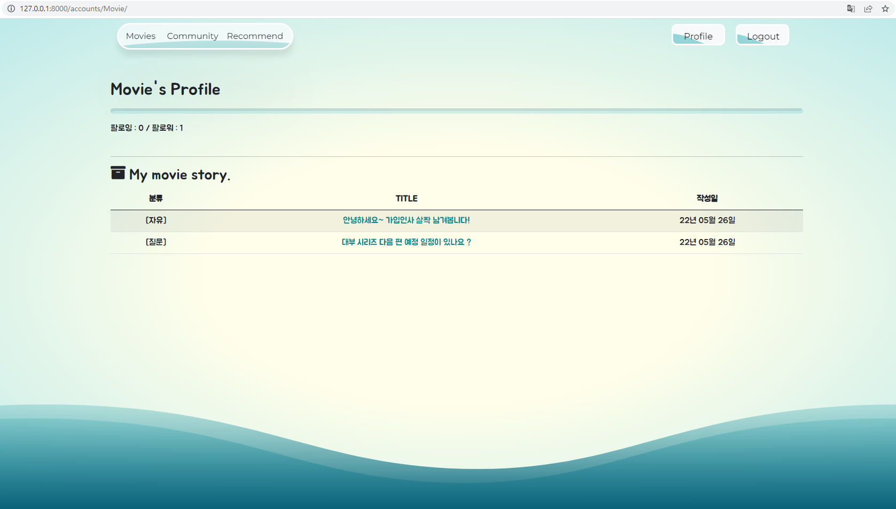

- 팔로잉, 팔로워 기능을 구현
- 유저가 community에 남긴 글을 table로 나타내도록 구현하고 title link를 통해 게시글로 이동할 수 있도록 구현


##### B. Home(Movie)

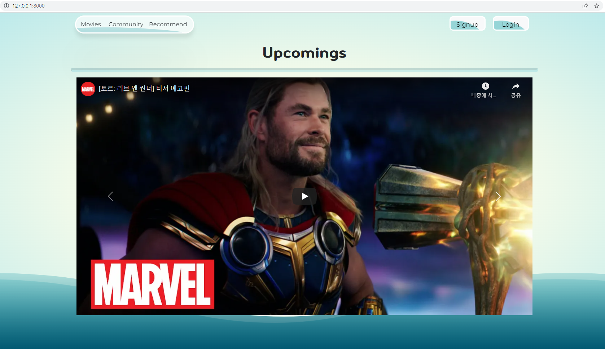

- Youtube를 활용하여 개봉 예정 영화의 티저 영상을 carousel로 구현


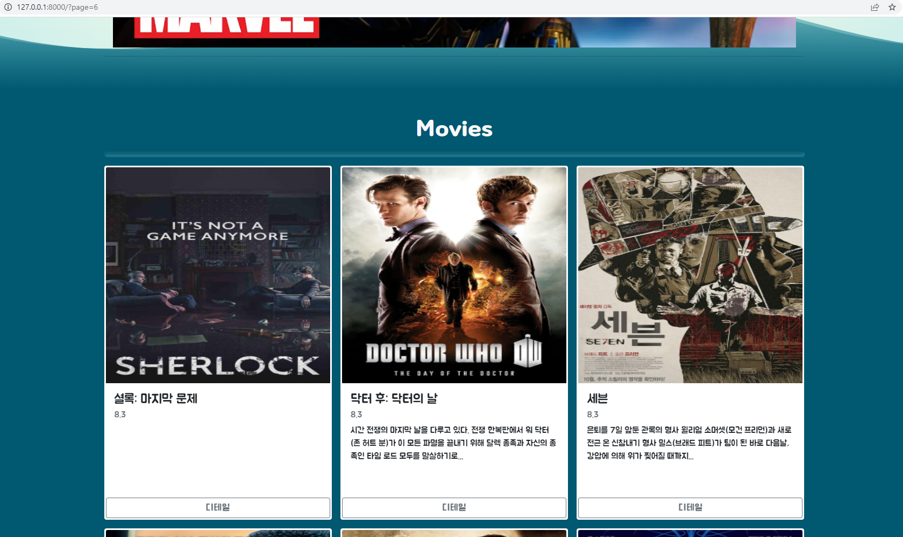

- card형식으로 영화의 간략한 정보를 출력


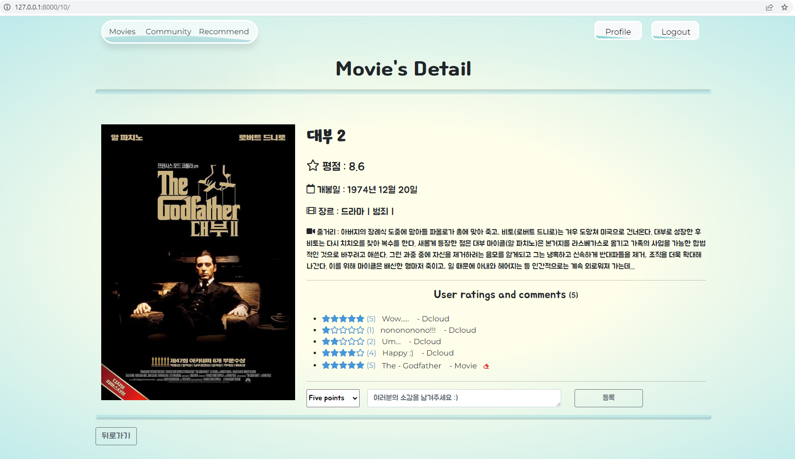

- 영화의 상세정보 페이지에서 좌측에는 영화의 포스터, 우측에는 영화명, 평점, 개봉일, 장르, 줄거리와 같은 영화의 정보가 나오도록 구현
- 영화의 정보 아래에 유저들이 별로 표현해주는 rating과 comment를 함께 남길 수 있는 기능을 구현


##### C. Community _ index, create, detail

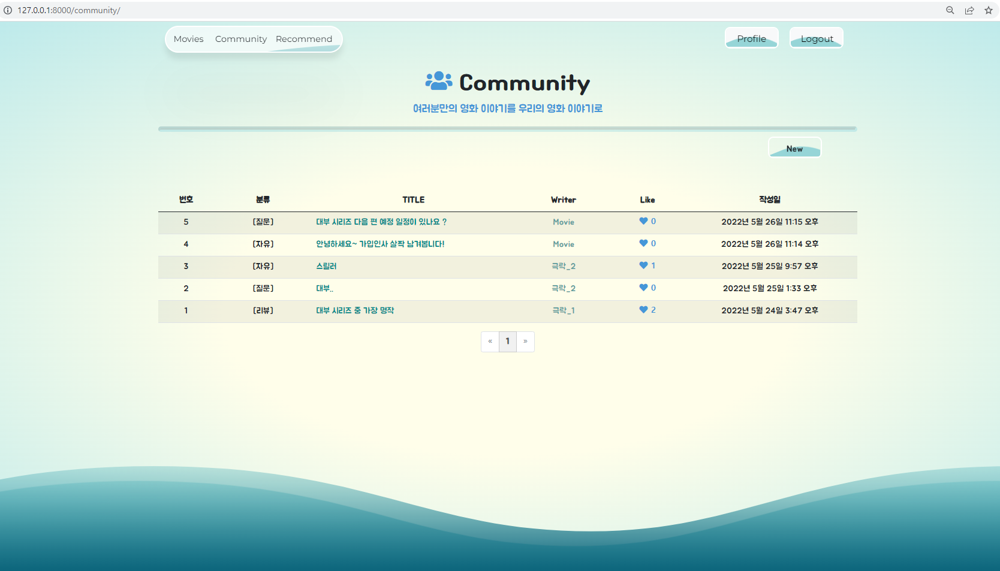

- 유저들이 작성한 게시글들을 table 형태로 분류, TITLE, Writer, Like 수, 작성일을 간략히 볼 수 있도록 구현하고 pagination을 통해 10개까지 볼 수 있도록 구현
- 게시글을 작성할 수 있도록 New 버튼을 구현


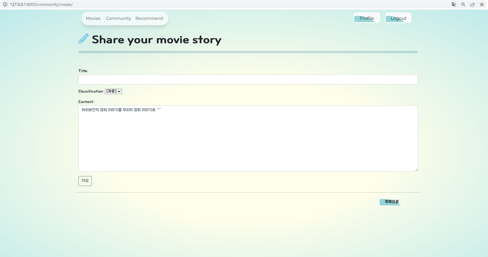

- 게시글을 작성할 수 있는 Form으로 [질문], [리뷰], [자유]로 분류하여 글을 의도를 미리 볼 수 있도록 구현


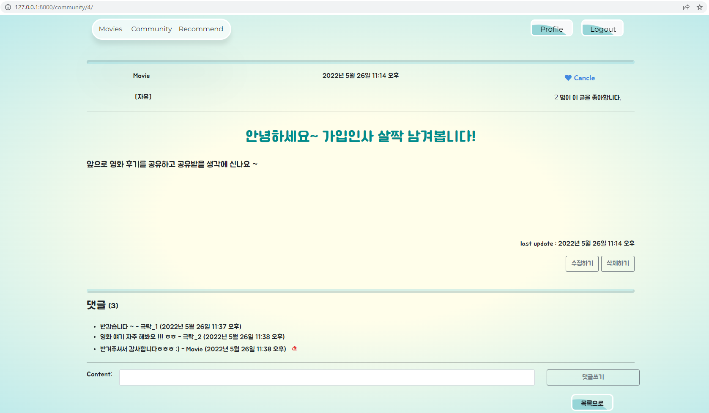

- 게시글 상세보기 페이지에 좋아요 기능을 구현하고 상단에 작성일과 본문의 우측 하단에 마지막 update 일을 나타낼 수 있도록 함
- 게시글은 해당 게시글을 작성한 유저만 수정, 삭제가 가능하도록 하고, 댓글은 해당 댓글을 작성한 유저만 삭제 가능하도록 구현


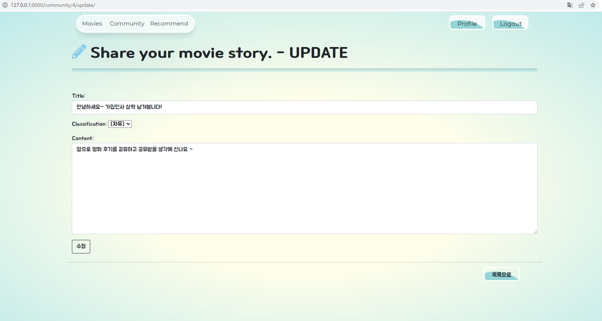

- 저장되어 있던 정보를 가지고오고 수정할 수 있도록 구현


### 3. 데이터베이스 모델링 (ERD)

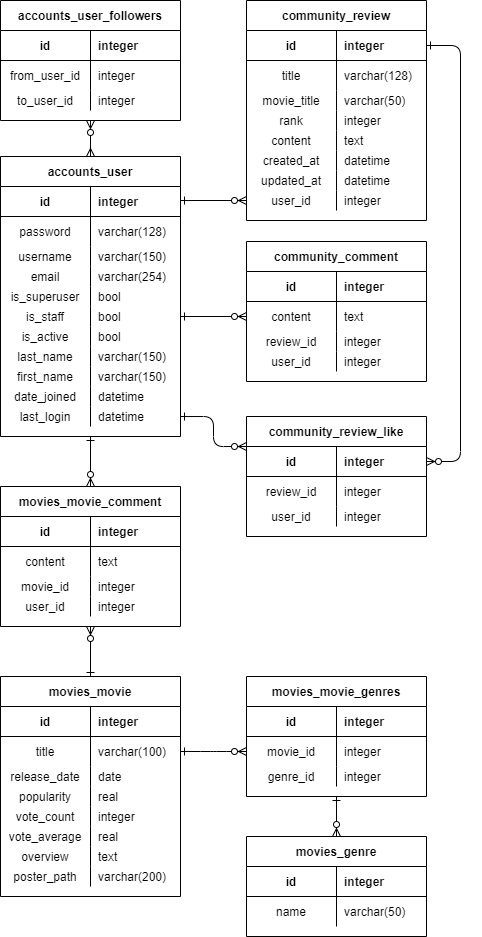


### 4. 필수 기능에 대한 설명

##### A. 관리자 뷰

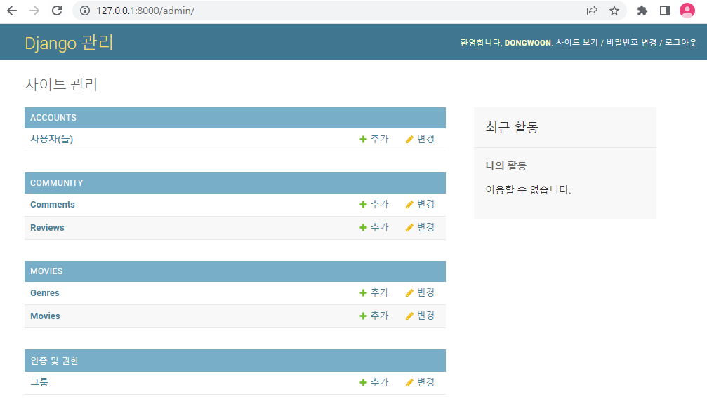

- 관리자 권한의 유저만 영화 등록 / 수정 / 삭제 권한을 가집니다.
- 관리자 권한의 유저만 유저 관리 권한을 가집니다.


##### B. 영화 정보

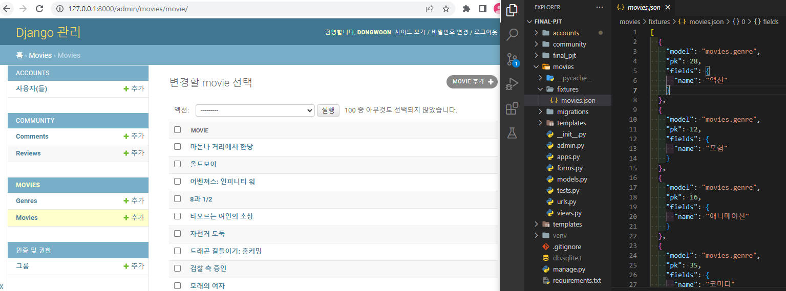

- TMDB 영화 데이터를  Database Seeding을 활용하여 100개의 데이터를 받아서 진행


##### C. Recommend

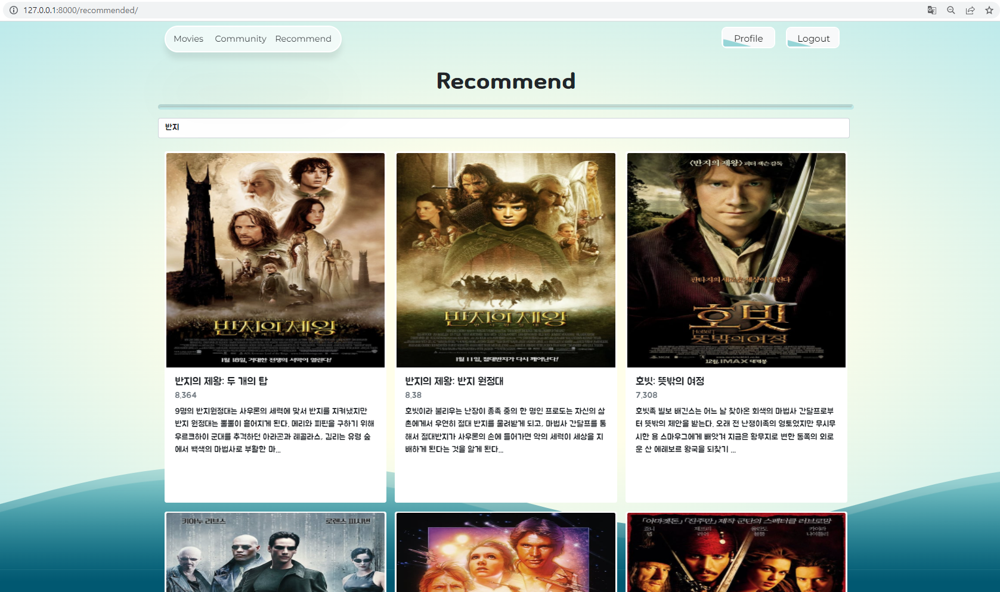

- 최장 공통 부분수열(Longest Common Subsequence)이라 불리는 LCS 알고리즘을 활용
- 문자 사이를 건너뛰어 공통되면서 가장 긴 부분 문자열을 찾는 이 알고리즘을 통해서 오탈자가 생기거나 부족하게 입력하였을 때도 최대한 그에 맞는 결과값을 제공하는 방식으로 검색할 영화를 결정
- 결정된 영화를 바탕으로 TMDB에서 제공하는 recommendations list를 받아와서 영화를 추천하는 시스템을 구현


##### D. 커뮤니티

- '목표 서비스 구현 및 실제 구현 정도' 참조


##### E. 기타

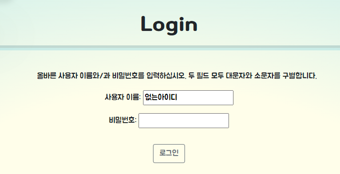

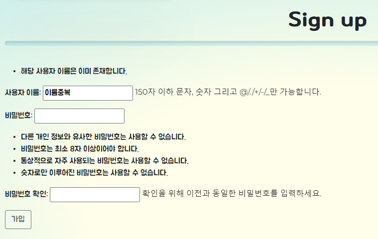

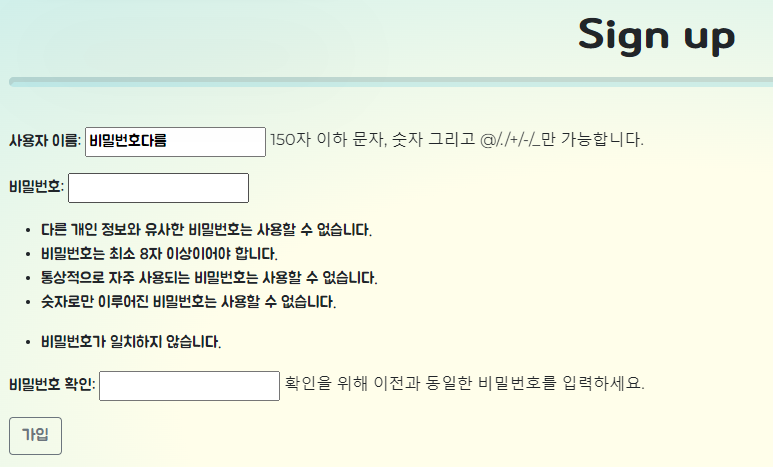


### 5. 느낀 점

##### A. 금동운

```
웹 개발에 대한 경험이 없는 상태로 1학기 과정을 시작하였습니다. 그리고 1학기동안 파이썬을 시작으로 차곡차곡 전반적인 부분을 쌓아왔고 이를 기반으로 1학기 최종 프로젝트를 진행하게 되었습니다.
짧은 기간동안 프로젝트가 진행되었지만 협업이라는 큰 틀 안에서 진행될 예정이었으며, 메인 키워드가 영화라고 결정되어 있었기에 상대적으로 부담이 덜한 상태로 시작할 수 있었습니다.
기획을 하면서 더욱 자세히 알아가는 과정이 필요했기에 다소 시간을 소요하였고, 구체적으로 구현을 이어가면서 현실적인 시간적 문제와 같은 부분으로 덜어내야하는 부분도 생겼기에 아쉬움도 어느정도 남기게 되었습니다.
하지만 이번 프로젝트도 협업을 하면서 생기는 오류를 잡아내고, 동시에 진행하고, 서로 케어를 해주고, 이슈나 고민을 공유하며 빠르게 답을 찾는 등 수많은 장점에 대해 느끼게 되었기에 만족감으로 이어지게 되었습니다.
마지막으로 다음 프로젝트를 한다면 메인 키워드와 틀이 정해지지 않은 상태에서 기획부터 시작할 것이기에 기획을 잘 할 수 있는 기반을 1달간 탄탄히 쌓아서 2학기로 넘어가야 함을 느꼈습니다.
```

##### B. 오광휘

```
 학기 간 배워왔던 웹개발을 일주일간 한 곳에 녹여낼 수 있었던 프로젝트였습니다.
명세된 대로 정확하게 구현을 해내는 것에 초점을 맞춰서 진행했던 기존 프로젝트들과는 달리, 우리 팀의 컨셉과 기능, 디자인 등을 직접 기획하고 구현해내는 과정에서 몇 배는 많은 고민과 정보 수집이 필요했습니다.
 특히 물결 버튼 및 파도 등을 구현할 때, 기존에는 한 가지 단위의 기능 정도만 추가를 함으로써 적용에 큰 어려움이 없었는데, 여러 컴포넌트들을 한번에 적용하려다보니 설정들이 꼬여 원하는 대로 구현하는데 에러사항들이 많았습니다. 하지만 이를 디버깅하는 과정에서 오히려 컴포넌트들이 어떤 원리로 적용이 되는지, 어떨 때 꼬이고 해결하는 방법은 무엇인지를 더욱 깊게 배울 수 있었습니다.
 우리만의 아이디어를 구현해내는 과정에서 평소보다 더 많은 에러와 마주했지만, 그만큼 완성했을 때 우리만의 결과물이라는 성취감과 애정이 생기는 것을 경험하였습니다. 또한, 앞으로 진행하게 될 프로젝트와 개발할 서비스의 경쟁력을 위해서 접목가능한 툴이나 라이브러리, 알고리즘을 더욱 폭 넓게 탐색해 볼 필요성을 느꼈습니다.
 최근 몇 개의 프로젝트들을 함께 해온 동운이형과 페어프로그래밍을 하면서, 그 간의 협업 경험 덕분에 업무 분담 및 협업 과정이 원활하였습니다. 이로 인해 프로젝트 구현에 더욱 집중할 수 있었고, 늘 많이 배려해주고 격려해주는 동운이형에게 감사를 전하고 싶습니다.


```

